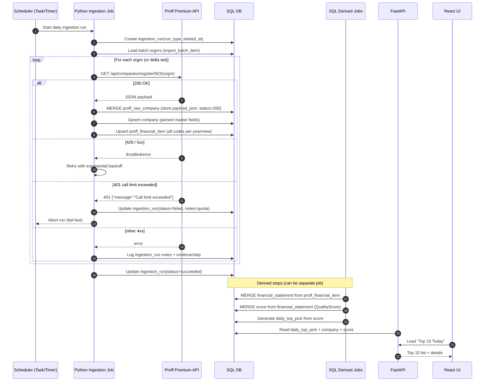

Below is a practical “architecture explainer” for **AWC DealRadar** as it exists in the prototype and as it naturally evolves into production. I’ll focus on:

1. **Database model (raw vs main vs derived)**
2. **Daily Proff ingestion workflow** end-to-end: *API calls → JSON → raw tables → main tables → derived tables → daily shortlist*

---

# 1) System overview

## Main components

* **Ingestion jobs (Python scripts)**

  * Build candidate batches from Proff search filters
  * Backfill company details and multi-year accounts
  * Daily delta updates (when enabled)
* **Database (SQL Server / Azure SQL later)**

  * Stores raw payloads, normalized entities, and derived scores
* **API (FastAPI)**

  * Exposes “Top 10”, company pages, workflow state (claiming, notes)
* **UI (React)**

  * Daily shortlist + company drill-down + activity log

## Design principle

**Store everything once, parse many times.**
That’s why we keep:

* Raw JSON payloads (“system of record for ingestion”)
* Parsed/normalized tables (“system of record for analytics + UI”)
* Derived tables (scores, daily list)

This gives you traceability, reproducibility, and lets you iterate the mapping/scoring without re-calling Proff.

---

# 2) Database architecture

Think of the DB in 3 layers:

## Layer A — Raw ingestion tables (immutable-ish)

Purpose: store exactly what came from Proff, with metadata.

### `proff_raw_company`

* **PK:** `orgnr`
* Columns:

  * `orgnr`
  * `http_status`
  * `payload_json` (NVARCHAR(MAX))
  * `fetched_at_utc`
  * `source_url`, `etag` (optional)
* Meaning:

  * The canonical copy of the last fetched Proff “company detail” payload.
  * If Proff quota gets exceeded, you should **fail fast** and avoid overwriting good payloads with 401/empty rows.

### (Optional) `proff_raw_owners`, `proff_raw_structure`

* Same pattern for owners and corporate structure payloads.

**Key property:** raw tables allow “rehydration” of everything else without new API calls.

---

## Layer B — Main normalized tables (used by UI & scoring)

Purpose: fast queries, stable schema, normalized business entities.

### `company`

* **PK:** `orgnr`
* Typical columns:

  * `name`, `nace`, `municipality`, address fields, `phone`, `email`, `website`
  * `sector_code`, `is_public_sector`, `excluded_reason`
  * `last_proff_fetch_at_utc`
* Notes:

  * “Public sector exclusion” is enforced here with flags.
  * This table is the main dimension table for UI.

### `proff_financial_item`

* **PK:** `(orgnr, fiscal_year, account_view, code)`
* Columns:

  * `orgnr`, `fiscal_year`
  * `account_view` = `'company'|'annual'|'corporate'`
  * `code` (Proff accounting code)
  * `value`, `currency`, `unit`
  * `fetched_at_utc`, `source`
* Notes:

  * This is your “fact table” for all raw accounting metrics.
  * Storing all codes is crucial: you can later change which ones you use for scoring without re-ingestion.

### `import_batch`, `import_batch_item`

* Purpose: stable population sets (your “universe” / screening sets)
* `import_batch`: `batch_id`, `batch_name`, `criteria`, created timestamp
* `import_batch_item`: `(batch_id, orgnr)` plus `include_reason`
* Examples:

  * `ebit_gt_50_2024` batch with ~2439 orgnrs

### Workflow tables (prototype/next)

These make DealRadar operational (your “daily operating model”).

* `outreach` (one row per orgnr)

  * owner, status, last_contact_at, next_step_at, cooldown_until
  * claimed_by/claimed_at (to prevent duplicate work)
* `activity_log` (many rows per orgnr)

  * timestamp, user, type (call/email/note/decision), summary, details

---

## Layer C — Derived tables (recomputed from main tables)

Purpose: curated outputs and speed.

### `financial_statement` (normalized)

* **Unique key conceptually:** `(orgnr, year, account_view)` (your table currently uses identity `id` but should be unique on these fields)
* Stores the small set of normalized metrics used everywhere:

  * `revenue`, `ebitda`, `ebit`, `assets`, `equity` (+ later CFO, net debt)
  * `source='proff'`, `fetched_at_utc`, `account_view`
* Built by a SQL MERGE pivot from `proff_financial_item`.

### `score`

* **Unique key:** `(orgnr, year)`
* Existing columns:

  * `total_score`, `compounder_score`, `catalyst_score`, `tags`, `computed_at`
* Semantics we’re using:

  * `compounder_score` = **QualityScore**
  * `catalyst_score` = DealLikelihood (later, once owners/news are integrated)
  * `total_score` = combined score for ranking

### `daily_top_pick`

* **Unique key:** `(pick_date, rank)` and `(pick_date, orgnr)`
* Output table consumed by API/UI:

  * pick_date, rank, orgnr
  * total_score_snapshot, reason_summary

---

# 3) Proff ingestion workflow (daily)

This describes the intended pipeline end-to-end:

## Step 0 — Configuration & constraints

* **Auth:** token in `.env` / environment variables
* **Hard constraint:** Proff trial quota limits → scripts must:

  * detect `401 {"message":"Call limit exceeded"}` and **abort early**
  * never overwrite good raw payloads with empty/error payloads
* **Idempotency:** use MERGE/upsert everywhere

---

## Step 1 — Build the universe (Proff search)

**Script:** `proff_build_batch_ebit2024.py`

### 1A) API call (search)

* `GET /api/companies/register/NO`
* Query params include:

  * `accounts = company|corporate` (account view selector)
  * `accountRange = DR|2024|50000:9999999999999` (example)
  * `pageSize = 100`
* Pagination:

  * Proff returns `pagination.next.href`
  * Continue until no next link

### 1B) Output

* Insert orgnr list into:

  * `import_batch` (once)
  * `import_batch_item` (MERGE per orgnr)

### 1C) Why this step is separate

This is cheap and fast. It defines your target set before you spend quota on details.

---

## Step 2 — Backfill details + financials (bulk)

**Script:** `proff_backfill_details.py`

### 2A) Input set

* Read all `orgnr` from `import_batch_item` for your batch
* Optionally skip already-complete orgnrs:

  * if `proff_raw_company.http_status=200 AND payload_json IS NOT NULL`

### 2B) API calls per orgnr

* `GET /api/companies/register/NO/{orgnr}`

### 2C) Intermediate JSON storage (“files”)

There are two options; you can do either or both:

**Option 1 (current): store JSON directly in DB**

* Write into `proff_raw_company.payload_json`
* Pros: simple, transactional, no file mgmt
* Cons: DB can get large (but 2439 companies × JSON is fine)

**Option 2 (optional): also write to disk**

* Save as `data/proff/raw/company/{orgnr}.json`
* Then store just a reference in DB (or store both)
* Pros: easy diff, quick debugging, external backups
* Cons: more moving parts

Most teams keep **DB as the primary raw store** and optionally export files for debugging.

### 2D) Parse JSON → main tables

From each JSON payload:

* Upsert `company` fields
* Extract all accounts:

  * loop over `companyAccounts`, `annualAccounts`, `corporateAccounts`
  * upsert into `proff_financial_item` for each `(orgnr, year, view, code)`

### 2E) Failure handling

* If response is 401 quota exceeded → **stop job**
* If response is transient (429/5xx) → retry with backoff
* If response is 404 (rare) → mark status but continue

---

## Step 3 — Materialize normalized financial_statement (SQL job)

**SQL MERGE** pivots `proff_financial_item` into `financial_statement`.

* For v1 you used:

  * revenue = SDI
  * ebit = DR
  * ebitda = EBITDA
  * assets = SED
  * equity = SEK

This step is fast and runs entirely in SQL.

---

## Step 4 — Compute scores (SQL job)

* MERGE into `score` table:

  * compute `compounder_score` from `financial_statement` (QualityScore v1)
  * set `total_score = compounder_score` initially
  * append explainability tags

Later, when you add ownership/news signals:

* compute `catalyst_score`
* compute a true combined `total_score`

---

## Step 5 — Generate daily shortlist (SQL job)

* Delete today’s picks in `daily_top_pick`
* Insert Top N rows from `score` for target year
* Snapshot total_score in the table

Later, add business rules:

* exclude public sector (`company.is_public_sector=1`)
* exclude within outreach cooldown (12 months)
* exclude already claimed

---

# 4) Daily “Proff workflow” summary (one-liner)

**Daily job chain:**

1. `Proff Changes` (future) or `RegisterCompany search` (now)
2. API response JSON
3. raw table `proff_raw_company`
4. parse to `company` + `proff_financial_item`
5. materialize `financial_statement`
6. compute `score`
7. build `daily_top_pick`

---

# 5) Recommended operational practices (so it stays robust)

## Fail-fast on quota exceeded

Treat these as fatal:

* `401 {"message":"Call limit exceeded"}`
* `401 {"message":"Invalid token"}`

Don’t write empty raw rows in those cases.

## Preserve good raw data

Only overwrite `proff_raw_company.payload_json` if:

* status = 200
* payload_json is not null
  Otherwise keep the previous good payload (if any).

## Checkpointing

Use:

* `ingestion_run` (for run metadata)
* `ingestion_checkpoint` (last processed orgnr)
  so you can resume without repeating API calls.

---

# 6) What I’d add next (small changes, big payoff)

1. Add a unique index to prevent duplicates in `financial_statement`:

   * `(orgnr, year, account_view)`
2. Add a “ingestion status” view:

   * how many companies in batch have raw 200 payloads, how many have financial_items, how many have score
3. Add a “dry run” mode that only validates:

   * auth
   * quota availability
   * first page response shape

---

## Table-by-table data dictionary

> Names reflect your current prototype. If a column isn’t present yet, treat it as “planned / recommended”.

### `dbo.import_batch`

Purpose: Defines a universe/batch (e.g. “EBIT>50MNOK 2024”).

| Column           | Type           | Notes                                     |
| ---------------- | -------------- | ----------------------------------------- |
| `batch_id`       | int identity   | PK                                        |
| `batch_name`     | nvarchar(100)  | Unique human key (e.g. `ebit_gt_50_2024`) |
| `criteria`       | nvarchar(1000) | Text description of filter                |
| `created_at_utc` | datetime2      | Audit                                     |

Recommended constraints/indexes:

* **UNIQUE** on `batch_name`

---

### `dbo.import_batch_item`

Purpose: Members of a batch (orgnr list).

| Column           | Type                 | Notes                      |
| ---------------- | -------------------- | -------------------------- |
| `batch_id`       | int                  | FK → `import_batch`        |
| `orgnr`          | char(9) / varchar(9) | Org number (canonical key) |
| `include_reason` | nvarchar(500)        | Optional reason            |
| `added_at_utc`   | datetime2            | Audit                      |

Recommended constraints/indexes:

* **PK** `(batch_id, orgnr)`
* Index on `orgnr` (for joins)

---

### `dbo.ingestion_run`

Purpose: Audit and operational record of ingestion jobs.

| Column            | Type             | Notes                                              |
| ----------------- | ---------------- | -------------------------------------------------- |
| `run_id`          | uniqueidentifier | PK                                                 |
| `run_type`        | nvarchar(50)     | e.g. `proff_backfill_details`, `proff_build_batch` |
| `batch_name`      | nvarchar(100)    | batch involved (optional)                          |
| `status`          | nvarchar(20)     | running/succeeded/failed                           |
| `started_at_utc`  | datetime2        |                                                    |
| `finished_at_utc` | datetime2        |                                                    |
| `notes`           | nvarchar(2000)   | Error summary / metrics                            |

Recommended constraints/indexes:

* Index on `(run_type, started_at_utc desc)`

---

### `dbo.ingestion_checkpoint`

Purpose: Resume-safe ingestion.

| Column           | Type             | Notes                    |
| ---------------- | ---------------- | ------------------------ |
| `run_id`         | uniqueidentifier | FK → `ingestion_run`     |
| `phase`          | nvarchar(50)     | e.g. `search`, `details` |
| `last_orgnr`     | char(9)          | last processed orgnr     |
| `last_offset`    | int              | last count/page          |
| `last_cursor`    | nvarchar(2000)   | next href/cursor         |
| `updated_at_utc` | datetime2        |                          |

Recommended constraints/indexes:

* **PK** `(run_id, phase)`

---

### `dbo.proff_raw_company`

Purpose: Stores latest raw JSON response for company detail.

| Column           | Type          | Notes                             |
| ---------------- | ------------- | --------------------------------- |
| `orgnr`          | char(9)       | PK                                |
| `http_status`    | int           | last fetch HTTP status            |
| `payload_json`   | nvarchar(max) | raw JSON (only store when 200 OK) |
| `fetched_at_utc` | datetime2     | when fetched                      |
| `source_url`     | nvarchar(800) | optional                          |
| `etag`           | nvarchar(200) | optional                          |

Recommended constraints/indexes:

* PK `orgnr`
* (Optional) filtered index for “good payloads”: `WHERE http_status=200 AND payload_json IS NOT NULL`

---

### `dbo.proff_financial_item`

Purpose: Key/value fact table for all Proff accounting codes.

| Column           | Type                  | Notes                          |
| ---------------- | --------------------- | ------------------------------ |
| `orgnr`          | char(9)               |                                |
| `fiscal_year`    | int                   |                                |
| `account_view`   | nvarchar(20)          | `company`/`annual`/`corporate` |
| `code`           | nvarchar(80)          | Proff code (e.g. `DR`, `SDI`)  |
| `value`          | decimal(19,2) / float | Code value (often KNOK)        |
| `currency`       | nvarchar(10)          | optional                       |
| `unit`           | nvarchar(20)          | optional                       |
| `fetched_at_utc` | datetime2             |                                |
| `source`         | nvarchar(50)          | `proff`                        |

Recommended constraints/indexes:

* **PK** `(orgnr, fiscal_year, account_view, code)` (you already designed it this way)
* Index `(fiscal_year, code)` for coverage and mapping
* Index `(orgnr, fiscal_year)` for company drilldowns

---

### `dbo.company`

Purpose: Master data for UI and filtering.

| Column                            | Type                 | Notes        |
| --------------------------------- | -------------------- | ------------ |
| `orgnr`                           | varchar(9) / char(9) | PK           |
| `name`                            | nvarchar(255)        |              |
| `nace`                            | nvarchar(10)         |              |
| `municipality`                    | nvarchar(100)        |              |
| `street` / `postal_code` / `city` | nvarchar             |              |
| `phone`                           | nvarchar(50)         |              |
| `email`                           | nvarchar(255)        |              |
| `website`                         | nvarchar(255)        |              |
| `sector_code`                     | nvarchar(50)         |              |
| `is_public_sector`                | bit                  | exclude flag |
| `excluded_reason`                 | nvarchar(200)        |              |
| `last_proff_fetch_at_utc`         | datetime2            |              |
| `created_at` / `updated_at`       | datetime2            |              |

Recommended constraints/indexes:

* **PK** `orgnr`
* Index on `nace`, `is_public_sector`
* Optional full-text index on `name`

---

### `dbo.financial_statement`

Purpose: Normalized metrics used for scoring (materialized view).

**Current schema (from your probe):**

* `id` (int identity PK)
* `orgnr` (varchar(9), not null)
* `year` (int, not null)
* `account_view` (nvarchar(40), nullable) — should be NOT NULL long-term
* `source` (nvarchar(100), not null)
* `fetched_at_utc` (datetime2)
* metrics: `revenue`, `ebitda`, `ebit`, `cfo`, `assets`, `equity`, `net_debt` (floats)

Recommended constraints/indexes:

* **UNIQUE INDEX** `(orgnr, year, account_view)` (after you backfill NULLs)
* Index `(year)` and `(orgnr, year)` for scoring and company drilldowns

Recommended data rule:

* Fill any NULL `account_view` to `'company'` and then set column NOT NULL.

---

### `dbo.score`

Purpose: Stores computed scores for ranking.

**Your current schema:**

* `id` identity PK
* `orgnr`, `year` (not null)
* `total_score`, `compounder_score`, `catalyst_score`
* `tags`
* `computed_at`

Recommended constraints/indexes:

* **UNIQUE INDEX** `(orgnr, year)` (you added this)
* Index on `(year, total_score desc)` for Top10 generation

Semantics:

* `compounder_score` = QualityScore
* `catalyst_score` = DealLikelihoodScore (future)
* `total_score` = ranking score (initially = compounder_score)

---

### `dbo.daily_top_pick`

Purpose: Daily output list (Top 10).

| Column                 | Type          | Notes        |
| ---------------------- | ------------- | ------------ |
| `id`                   | int identity  | PK           |
| `pick_date`            | date          |              |
| `rank`                 | int           |              |
| `orgnr`                | char(9)       |              |
| `total_score_snapshot` | float         | freeze score |
| `reason_summary`       | nvarchar(500) |              |

Recommended constraints/indexes:

* **UNIQUE** `(pick_date, rank)`
* **UNIQUE** `(pick_date, orgnr)`
* Index `(pick_date)`

---

### (Planned) `dbo.outreach`

Purpose: Who is working the case, status, cooldown.

Key fields:

* `orgnr` (PK, FK to company)
* `claimed_by`, `claimed_at`, `claim_status`
* `owner`, `status`, `last_contact_at`, `next_step_at`, `cooldown_until`
* `note`, `updated_at`

Indexes:

* `(claimed_by, claim_status)`
* `(status, next_step_at)`
* `(cooldown_until)`

---

### (Planned) `dbo.activity_log`

Purpose: timeline of notes/communications/decisions.

Key fields:

* `id` identity PK
* `orgnr` (FK)
* `timestamp`, `user`
* `type` enum (`analysis_note`, `call`, `email`, `meeting`, `decision`)
* `summary`, `details`, `next_step_at`

Indexes:

* `(orgnr, timestamp desc)`

---

## Key constraints and indexes summary (recommended minimum)

**Must-have**

* `import_batch(batch_name)` unique
* `import_batch_item(batch_id, orgnr)` PK
* `proff_financial_item(orgnr, fiscal_year, account_view, code)` PK
* `score(orgnr, year)` unique
* `daily_top_pick(pick_date, rank)` unique
* `daily_top_pick(pick_date, orgnr)` unique

**Strongly recommended**

* `financial_statement(orgnr, year, account_view)` unique (after cleaning NULL views)
* `company(orgnr)` PK, and index on `is_public_sector`

**Performance**

* `proff_financial_item(fiscal_year, code)` index (coverage + mapping)
* `score(year, total_score)` index (Top 10)
* `daily_top_pick(pick_date)` index

---

## Sequence diagram: Daily Proff ingestion (end-to-end)

---

## Error / retry / quota-handling rules

### 1) Quota exceeded (must fail fast)

**Signature:** `401 {"message":"Call limit exceeded"}`

Rules:

* Abort the run immediately (don’t continue looping orgnrs)
* Mark `ingestion_run.status = 'failed'`, `notes='quota exceeded'`
* Do **not** overwrite existing good `proff_raw_company.payload_json`
* Optional: set a global “ingestion_blocked_until” timestamp for your scheduler

### 2) Invalid token (must fail fast)

**Signature:** `401 {"message":"Invalid token"}`

Rules:

* Abort immediately; requires operator action
* Do not write raw rows with empty payload
* Log exact endpoint + response body for support ticket

### 3) Rate limiting (retry)

**Signature:** HTTP 429

Rules:

* Retry with exponential backoff:

  * base 1s, doubling each attempt (1s, 2s, 4s, 8s…)
  * max attempts ~6
* Respect `Retry-After` header if present
* If repeated 429s persist, slow down concurrency (or switch to delta mode)

### 4) Transient server errors (retry)

**Signatures:** 500, 502, 503, 504

Rules:

* Retry with exponential backoff
* If still failing after max retries, log orgnr failure and continue (unless failure rate is high)

### 5) Payload storage policy (protect good data)

Only write/overwrite `proff_raw_company.payload_json` when:

* status == 200 and JSON parsed successfully

For non-200 responses:

* update `http_status` and `fetched_at_utc` **only if** you don’t already have a good payload, or store errors in a separate `proff_raw_company_error_log` table.

### 6) Idempotency and resumability

* All upserts via `MERGE` keyed by stable natural keys:

  * company: orgnr
  * financial item: orgnr+year+view+code
* Maintain checkpoints (`ingestion_checkpoint`) every N orgnrs/pages
* Always able to re-run safely without duplicates

### 7) “Rehydrate mode” (no API calls)

When Proff calls are blocked (quota), you can still:

* re-parse from `proff_raw_company.payload_json` into main tables
* rerun normalization and scoring repeatedly

This is why raw payload persistence is central.

---
## Data lineage

This section documents where each key field in DealRadar comes from, and how it flows from Proff → raw → main → derived → score → daily list.

### Lineage layers (conceptual)

1. **Proff API response JSON** (source of truth for ingestion)
2. **Raw DB tables** (`proff_raw_company.payload_json`)
3. **Main parsed tables**

   * `company` (master data)
   * `proff_financial_item` (all accounting codes)
4. **Derived tables**

   * `financial_statement` (normalized metrics)
   * `score` (computed ranking features)
   * `daily_top_pick` (daily snapshot)

---

### A) Company master data lineage

| DealRadar field          | Source                              | Raw location              | Parsed location                   | Notes                                   |
| ------------------------ | ----------------------------------- | ------------------------- | --------------------------------- | --------------------------------------- |
| `orgnr`                  | Proff company id/orgnr              | `proff_raw_company.orgnr` | `company.orgnr`                   | Natural key across system               |
| `name`                   | Proff company name                  | payload_json              | `company.name`                    |                                         |
| `email`                  | Proff company email                 | payload_json              | `company.email`                   | Often missing                           |
| `phone`                  | Proff phone                         | payload_json              | `company.phone`                   | Often missing                           |
| `website`                | Proff homepage/homePage             | payload_json              | `company.website`                 |                                         |
| `nace` / NACE categories | Proff naceCategories / industryCode | payload_json              | `company.nace`                    | Keep raw categories if available        |
| `address` fields         | Proff address object                | payload_json              | `company.street/postal_code/city` |                                         |
| `sector_code`            | Proff sector classification         | payload_json              | `company.sector_code`             | Used for exclusion and segmentation     |
| `is_public_sector`       | Proff flag if available, else rules | payload_json + rules      | `company.is_public_sector`        | MUST be enforceable via manual override |
| `excluded_reason`        | Derived                             | n/a                       | `company.excluded_reason`         | e.g. `public_sector`                    |

**Rule:** master data should be upserted from raw payloads whenever a new payload arrives.

---

### B) Accounting code lineage (full fidelity)

This is the key to flexibility: store *all* codes rather than a pre-selected subset.

| Field         | Source                | Raw          | Main table                           | Key                            |
| ------------- | --------------------- | ------------ | ------------------------------------ | ------------------------------ |
| fiscal year   | Proff accounts year   | payload_json | `proff_financial_item.fiscal_year`   |                                |
| account view  | Proff view arrays     | payload_json | `proff_financial_item.account_view`  | `company`/`annual`/`corporate` |
| code          | Proff accounting code | payload_json | `proff_financial_item.code`          | e.g. `DR`, `SDI`, `EBITDA`     |
| value         | Proff value           | payload_json | `proff_financial_item.value`         | Most often KNOK in NO datasets |
| unit/currency | Proff metadata        | payload_json | `proff_financial_item.unit/currency` |                                |

**Primary key:** `(orgnr, fiscal_year, account_view, code)`.

This table is the “truth” for all financial metrics and enables recomputation without more API calls.

---

### C) Normalized financial_statement lineage (selected codes)

`financial_statement` is a materialized “view” that makes scoring and UI simple. It is derived from `proff_financial_item` via SQL MERGE/pivot.

Recommended v1 mapping (based on high-coverage codes you observed):

| financial_statement column | Proff code | proff_financial_item filter | Notes                                                            |
| -------------------------- | ---------- | --------------------------- | ---------------------------------------------------------------- |
| `revenue`                  | `SDI`      | `account_view='company'`    | Sum driftsinntekter                                              |
| `ebit`                     | `DR`       | `account_view='company'`    | Driftsresultat (EBIT)                                            |
| `ebitda`                   | `EBITDA`   | `account_view='company'`    | Provided for most companies in sample                            |
| `assets`                   | `SED`      | `account_view='company'`    | Sum eiendeler                                                    |
| `equity`                   | `SEK`      | `account_view='company'`    | Sum egenkapital                                                  |
| `cfo`                      | (future)   | n/a                         | If/when Proff exposes CFO reliably                               |
| `net_debt`                 | (future)   | n/a                         | Ideally computed from interest-bearing debt & cash (needs codes) |

**Units:** In Norway, many accounting values appear to be in **KNOK**. Always confirm using `unit` in `proff_financial_item` for correctness.

---

### D) Score lineage (QualityScore + DealLikelihood + Total)

#### v1 (currently)

* `compounder_score` (QualityScore) is computed from `financial_statement` for a given year and view.
* `catalyst_score` set to 0 or kept as-is until owners/news is integrated.
* `total_score` = `compounder_score` (until combined scoring is active)

| score field        | Computed from                       | Key inputs                            | Notes                    |
| ------------------ | ----------------------------------- | ------------------------------------- | ------------------------ |
| `compounder_score` | `financial_statement`               | revenue, ebit, ebitda, assets, equity | Includes BQS + DPS logic |
| `catalyst_score`   | (future)                            | owners, roles, news, freshness        | DealLikelihood           |
| `total_score`      | compounder + catalyst (+ penalties) | same                                  | ranking value            |
| `tags`             | explainability                      | bands / flags                         | store as text or JSON    |

#### Future (target)

* `total_score = f(compounder_score, catalyst_score, competition_penalty)`
  Example:
* `total_score = compounder_score * (1 + catalyst_score/100) - competition_penalty`

---

### E) Daily shortlist lineage

`daily_top_pick` is a daily snapshot derived from `score`.

| daily_top_pick field   | Derived from                  | Notes                |
| ---------------------- | ----------------------------- | -------------------- |
| `pick_date`            | system date                   |                      |
| `rank`                 | row_number ordering           |                      |
| `orgnr`                | score.orgnr                   |                      |
| `total_score_snapshot` | score.total_score             | freeze for audit     |
| `reason_summary`       | score.tags or computed string | explain why included |

**Important:** daily_top_pick should be re-generated deterministically each day. In production, keep history (don’t delete old dates).

---

## Minimal production hardening checklist

This is the smallest set of changes to go from “prototype on laptop” to “reliable internal tool” without over-engineering.

### 1) Hosting & environments

**Goal:** reproducible dev/stage/prod separation.

* Create 3 environments:

  * `dev` (fast iteration)
  * `stage` (pre-prod validation)
  * `prod` (stable daily usage)
* Use environment variables for config:

  * DB connection
  * Proff token
  * Grok token
  * feature flags (news on/off, owners on/off)

### 2) Database hardening (Azure SQL-ready)

* Move to **Azure SQL Database** (managed backups, monitoring)
* Apply:

  * **Unique constraints** to prevent duplication:

    * `proff_financial_item` PK already good
    * add unique index for `financial_statement(orgnr, year, account_view)`
    * `score(orgnr, year)` already unique
    * `daily_top_pick(pick_date, rank)` + `(pick_date, orgnr)` unique
* Add **foreign keys** where safe:

  * `financial_statement.orgnr → company.orgnr` (optional early, recommended later)
* Partitioning not required at your scale; indexing is enough.

### 3) Secrets & identity

* Store API keys in:

  * **Azure Key Vault** (preferred), or App Service settings
* Remove `.env` from production deployments
* Use **Managed Identity** for App → Azure SQL access (no DB passwords)

### 4) Authentication & authorization (AWC users only)

* Use Microsoft **Entra ID** SSO:

  * simplest: App Service Authentication (Easy Auth)
  * enforce tenant-only access
* Authorization:

  * Entra Groups or App Roles:

    * `DealRadar.Users`, `DealRadar.Admins`
* In the app:

  * map user principal → `claimed_by`, `activity_log.user`

### 5) Scheduling the daily workflow

Replace “manual run” with a managed scheduler.

Options:

* **Azure Functions (Timer Trigger)**: great for Python jobs
* **Azure Container Apps Job**: good if you containerize ingestion
* **GitHub Actions schedule**: OK for MVP, but less ideal for secrets and reliability

Recommended minimal setup:

* 1 scheduled ingestion job (Proff delta + parsing)
* 1 scheduled derive job (financial_statement + score + daily_top_pick)

### 6) Observability (minimum)

* Centralized logs:

  * App logs (API/UI)
  * Job logs (ingestion)
* Persist job outcomes:

  * `ingestion_run` status and error notes (already present)
* Alerts:

  * fail ingestion → notify Teams/email
  * quota exceeded → notify and pause retries

### 7) Quota / rate-limit hardening

* Implement a “quota exceeded” guard:

  * detect body contains `Call limit exceeded`
  * stop job immediately
  * set a DB flag `ingestion_blocked_until` (optional)
* Throttling:

  * handle 429 with backoff + Retry-After
  * reduce concurrency (keep it low)

### 8) Data governance & auditability

* Keep raw payloads (`proff_raw_company`) for traceability.
* Never overwrite good payloads with empty/401 payloads.
* Keep daily_top_pick history (don’t delete previous dates).
* Store “why included” tags and thresholds (you already do).

### 9) Operational workflow hardening

* Claiming concurrency:

  * atomic claim update with constraint to prevent two owners simultaneously
* 12-month outreach cooldown:

  * enforce in query that generates daily_top_pick
* Exclude public sector:

  * enforce during scoring and shortlist generation
  * allow manual override list

### 10) Deployment automation (minimum)

* One repo with:

  * backend (FastAPI)
  * jobs (ingestion/derive)
  * frontend (React)
* CI/CD:

  * build & deploy backend and frontend on main branch
  * run DB migrations (or SQL scripts) safely

---

If you want, I can also provide:

* A concrete “prod daily workflow” as two Azure Function timers (with exact trigger schedules)
* A set of “SQL health checks” (counts by http_status, missing financial years, score coverage, daily top pick freshness)
* A minimal “rehydrate from raw” job that never touches Proff (useful when quota blocks you)
